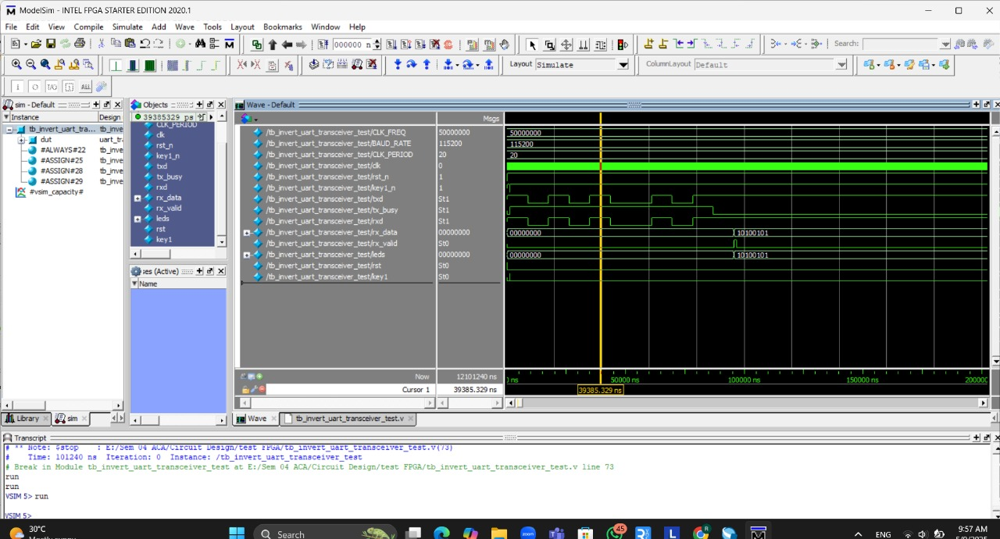

# UART Transceiver Implementation on DE0-Nano FPGA

This repository contains a project developed for the **EN2111 Electronic Circuit Design** module at the **University of Moratuwa**. The project focuses on implementing a **UART (Universal Asynchronous Transceiver)** communication link between two **DE0-Nano FPGA development boards**, providing a hands-on understanding of serial communication protocols in an FPGA environment.

## 🚀 Project Overview

The goal was to establish a working UART link between two DE0-Nano boards using **Verilog**, **Quartus Prime**, and **ModelSim**. The project involved:

- **Designing** UART transmitter and receiver modules in SystemVerilog.
- **Simulating** and verifying functionality using ModelSim.
- **Integrating** the receiver with a 7-segment display to show received binary data.

---
## 🔧 Physical Implementation

The following image shows the actual setup of two DE0-Nano FPGA boards communicating via UART. One board sends a value, the other multiplies it by 2 and returns the result, which is displayed on a 7-segment display.

## 🧩 Key Modules in ACTIVE LOW

### 🔁 UART Communication
- `uart_rx.v`: UART receiver (active-low logic)
- `uart_tx.v`: UART transmitter (active-low logic)

### 🔄 System Integration & Testing
- `invert_uart_transceiver_test.v`: Basic test setup for UART send/receive
- `invert_uart_transceiver_crosscheck.v`: Implements bidirectional logic with multiplication and return
- `tb_invert_uart_transceiver_test.v`: Testbench for simulation

### 📟 Display Output
- `invert_uart_transceiver_test_segmant.v`: Connects received data to 7-segment logic
- `hex_to_7seg.v`: Converts 4-bit binary to 7-segment display code

---

## 🛠 Tools Used

- **Quartus Prime 20.1.1** – Synthesis and FPGA programming
- **ModelSim** – Simulation and waveform analysis

---

## 📁 Repository Structure of Active Low Codes

- uart_rx.v  
  └─ UART receiver module (active-high)

- uart_tx.v  
  └─ UART transmitter module (active-high)

- invert_uart_transceiver_test.v  
  └─ Basic UART send/receive test logic(Active low)

- invert_uart_transceiver_crosscheck.v  
  └─ Bidirectional test: one board sends → other multiplies by 2 → sends back

- invert_uart_transceiver_test_segmant.v  
  └─ Displays received value on 7-segment display

- hex_to_7seg.v  
  └─ Converts 4-bit hex value to 7-segment encoding

- tb_invert_uart_transceiver_test.v  
  └─ Testbench for simulating UART communication and verifying logic

## ⏱️ Timing Diagram

The following waveform shows the UART transmission and reception cycle simulated using ModelSim.

## ✅ Functionality Overview

- **Data Transmission**: UART TX sends binary data serially using start/stop bits.
- **Data Reception**: UART RX receives and decodes the serial data.
- **Cross Communication**: One FPGA board sends a number, another processes (×2) and returns it.
- **Display Output**: The original board displays the final number using a 7-segment display.

---

## 🔍 Simulation and Verification

1. Simulate the system using `tb_invert_uart_transceiver_test.v`.
2. Observe serial waveforms and validate data correctness.
3. Refer to timing diagrams and test vectors in the report for reference.

---

